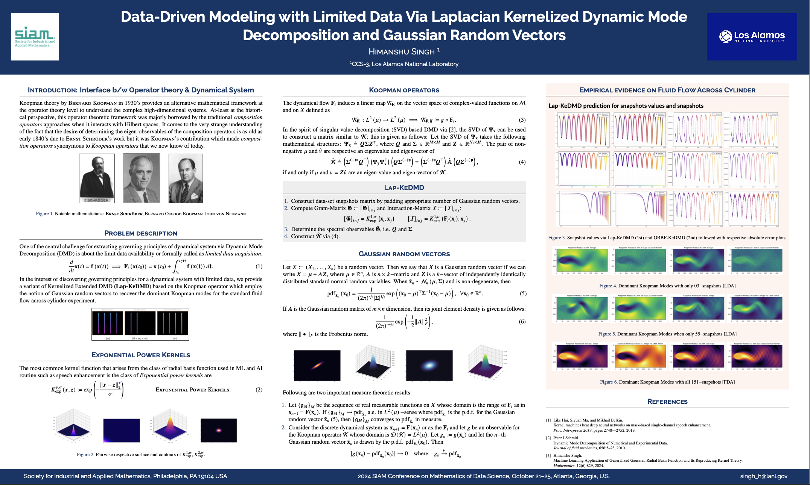

# SIAM MDS 2024 Research Poster
## Scientific Machine Learning and Data Science

### A Research Poster by **Himanshu Singh**

Scientific Machine Learning • Mathematical AI • Sparse Learning • Neural Operators

---

# Overview

This repository hosts the **research poster presented at the SIAM Conference on Mathematics of Data Science (SIAM MDS 2024)**.

The work explores ideas at the intersection of:

• **Scientific Machine Learning**  
• **Mathematical Foundations of AI**  
• **Sparse Learning and Efficient Representations**  
• **Operator Learning and Dynamical Systems**

The poster highlights how **modern machine learning architectures can be combined with mathematical structure** to build interpretable and scalable learning systems for scientific data.

---

# Poster

**[Download poster](https://github.com/himanshuvnm/POSTER_SIAM_MDS_2024/blob/main/SIAM_MDS_POSTER.pdf)**

---

# Poster Preview

---

# Motivation

Many modern scientific problems involve:

• high-dimensional dynamical systems  
• structured physical data  
• expensive numerical simulations  

Traditional computational pipelines rely on **large-scale numerical solvers**, which can be computationally expensive.

Scientific machine learning provides an alternative approach:

> **Learning structure directly from data while preserving mathematical constraints.**

This research investigates how **learning-based representations can complement classical mathematical modeling.**

---

# Key Ideas

The poster highlights several themes in modern mathematical machine learning.

### Sparse Learning

Sparse representations allow models to identify the **most informative components of a system** while reducing computational complexity.

This connects to:

• $\ell_0$ and $\ell_1$ sparsity  
• interpretable model structures  
• efficient learning pipelines

---

### Scientific Machine Learning

Scientific ML integrates **physics-based modeling with data-driven learning**.

Applications include:

• surrogate modeling  
• reduced-order modeling  
• accelerated simulation

---

### Operator Learning

Recent neural operator architectures such as **Fourier Neural Operators (FNO)** enable learning mappings between infinite-dimensional function spaces.

These approaches are promising for:

• PDE learning  
• dynamical systems modeling  
• scalable scientific prediction

---

# Research Context

This work sits within the broader landscape of **AI for scientific discovery**, where machine learning methods are increasingly used to:

• accelerate simulation  
• discover physical relationships  
• model complex dynamical systems

The poster contributes to ongoing discussions on **mathematically grounded AI systems** for scientific domains.

---

# Author

**Himanshu Singh**

Research interests include:

• scientific machine learning  
• sparse and efficient learning  
• neural operators  
• mechanistic interpretability  
• mathematical foundations of AI

---

# Related Projects

You may find these related repositories useful.

### Mechanistic AI Interpretability

Understanding reasoning circuits inside transformer models.

https://github.com/himanshuvnm/Mechanistic_Artificial_Intelligence_Interpretability

---

### Learning Fourier Neural Operators

Operator learning for PDE surrogate modeling.

https://github.com/himanshuvnm/Learning_Fourier_Neural_Operator

---

### Sparse Neural Networks

Learning sparse model structures via hard-threshold masking.

https://github.com/himanshuvnm/Sparse_Neural_Network

---

# Citation

If you use or reference this work, please cite the repository.
